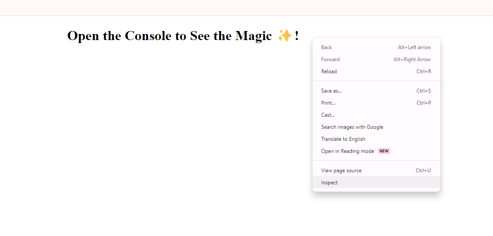
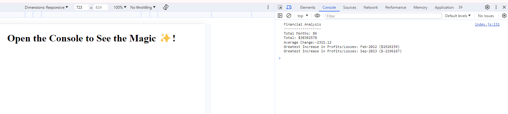

# Console-Finances

## A program for analyzing the financial records of a company

This project was carried out to create an app that analyses the raw data of the financial records of a company.

## Installation

To use this webpage, the user must have access to the internet. Enter, in the search bar, the address "https://github.com/Antimio/Console-Finances" and press Enter.

## Usage

To use the webpage:

1 - Navigate to it and, anywhere on the page, right-click and select "Inspect"

2 - In the Ispect page, go to the Console tab

## Credits

The EdEx Web Development bootcamp team provided the boilerplate HTML code and images used in this project: https://skillsforlife.edx.org/enroll/ui/signIn

## License

MIT License

Copyright (c) [2023] [Antimio Luale Da Silva Monteiro Casimiro]

Permission is hereby granted, free of charge, to any person obtaining a copy
of this software and associated documentation files (the "Software"), to deal
in the Software without restriction, including without limitation the rights
to use, copy, modify, merge, publish, distribute, sublicense, and/or sell
copies of the Software, and to permit persons to whom the Software is
furnished to do so, subject to the following conditions:

The above copyright notice and this permission notice shall be included in all
copies or substantial portions of the Software.

THE SOFTWARE IS PROVIDED "AS IS", WITHOUT WARRANTY OF ANY KIND, EXPRESS OR
IMPLIED, INCLUDING BUT NOT LIMITED TO THE WARRANTIES OF MERCHANTABILITY,
FITNESS FOR A PARTICULAR PURPOSE AND NONINFRINGEMENT. IN NO EVENT SHALL THE
AUTHORS OR COPYRIGHT HOLDERS BE LIABLE FOR ANY CLAIM, DAMAGES OR OTHER
LIABILITY, WHETHER IN AN ACTION OF CONTRACT, TORT OR OTHERWISE, ARISING FROM,
OUT OF OR IN CONNECTION WITH THE SOFTWARE OR THE USE OR OTHER DEALINGS IN THE
SOFTWARE.